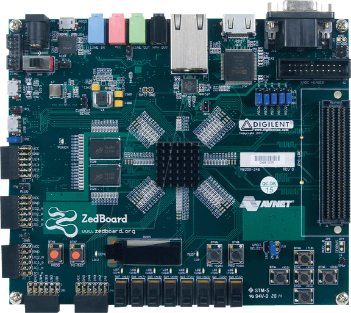

# Hardware

DMon has been tested on an Avnet Zedboard embeded a Zynq SoC. It could be ported to any SoC mixing a CPU and a FPGA fabric. The Zynq CPU runs the re-hosted code natively, while DMON digital components are emulated on the FPGA. Both interact seamlessly to enable code re-hosting.

In addition, DMon offers a relatively fast data tracer over a USB 3.0 interface. For this purpose, a Cypress FX3 board is attached to the FMC connector of the Zynq.   

We recommand the FMC breakout board to interface the Cypress FX3 to the Zedboard.  

